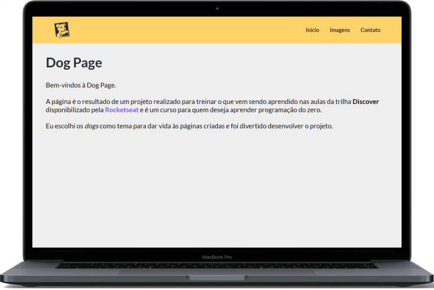

 <p align="center" style="font-size: 40px">
    Dog Page
  </p>

  <p align="center">
    
  </p>

<p align="center">
      A página é o resultado de um projeto realizado para treinar o que vem sendo aprendido nas aulas da trilha <strong>Discover</strong> disponibilizado pela <a id="rocketseat" href="https://rocketseat.com.br/">Rocketseat</a> e é um curso para quem deseja aprender programação do zero.
</p>

<p align="center">
  

  

  
</p>

<p align="center">
  <a href="#funcionalidades">Funcionalidades</a>&nbsp;&nbsp;&nbsp;|&nbsp;&nbsp;&nbsp;
  <a href="#heavy_check_mark-configurações-necessárias">Configurações necessárias</a>&nbsp;&nbsp;&nbsp;|&nbsp;&nbsp;&nbsp;
  <a href="#arrow_down_small-clonando-o-repositório">Clonando o repositório</a>&nbsp;&nbsp;&nbsp;|&nbsp;&nbsp;&nbsp;
  <a href="#beginner-iniciando-a-aplicação">Iniciando a aplicação</a>&nbsp;&nbsp;&nbsp;|&nbsp;&nbsp;&nbsp;
  <a href="#wrench-tecnologias--ferramentas--recursos">Tecnologias | Ferramentas | Recursos</a>&nbsp;&nbsp;&nbsp;|&nbsp;&nbsp;&nbsp;
  <a href="#memo-license">Licença</a>
</p>

### Funcionalidades

- Página de início;
- Página de imagens;
- Página de contato;
- Cabeçalho em todas as páginas com links;
- Contatos com links conforme sua categoria.

### :heavy_check_mark: Configurações necessárias

Seguem as configurações neessárias para visualizar a aplicação em sua máquina.

-  [Git](https://git-scm.com).

### :arrow_down_small: Clonando o repositório
1. Pelo terminal, acesse o diretório em que deseja ter o repositório clonado e execute o comando a seguir.
```bash
# clonando o repositório
git clone https://github.com/belapferreira/dogpage
```

### :beginner: Iniciando a aplicação
1. Abra o arquivo `index.html` no navegador para visualizar as páginas criadas.

### :wrench: Tecnologias | Ferramentas | Recursos

Esse projeto foi desenvolvido utilizando `HTML` e `CSS`.

### :memo: License
Esse projeto está sob MIT license. Veja [LICENSE](https://github.com/belapferreira/dogpage/blob/master/LICENSE) para mais informações.

---

Feito por Bela Ferreira :blue_heart: Contato: https://www.linkedin.com/in/belapferreira :blush: